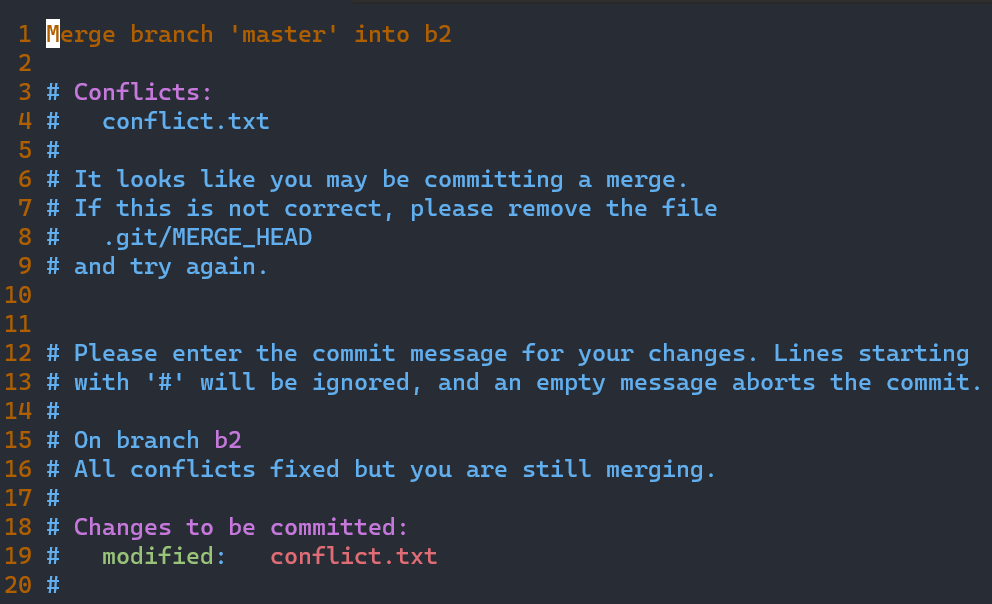
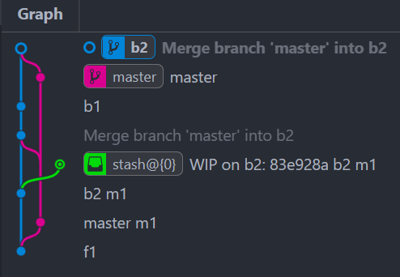

## Git Conflict
多个分支同时改动一个文件后merge会引发git冲突。为了解决 git conflict, 一般总是可以通过固定的步骤按需选择需要的部分，然后commit完成冲突解决。

下面以一个例子说明：

### present status

```Bash
(base) root@DESKTOP-F:~/workspace/bin/git_prac# git branch
  b2
* master
(base) root@DESKTOP-F:~/workspace/bin/git_prac# cat conflict.txt
line master
(base) root@DESKTOP-F:~/workspace/bin/git_prac# git checkout b2
Switched to branch 'b2'
(base) root@DESKTOP-F:~/workspace/bin/git_prac# cat conflict.txt
line b1
```

### try to merge
显然，两个分支中的`conflict.txt`文件内容不一致，合并时会发生`conflict`。如下合并操作：

```bash
(base) root@DESKTOP-F:~/workspace/bin/git_prac# git branch
* b2
  master
(base) root@DESKTOP-F:~/workspace/bin/git_prac# git merge master
Auto-merging conflict.txt
CONFLICT (content): Merge conflict in conflict.txt
Automatic merge failed; fix conflicts and then commit the result.
(base) root@DESKTOP-F:~/workspace/bin/git_prac# 
```

确实提示出现了`Merge conflict`.

### fix conflict
按照提示，在当前分支打开`conflict.txt`:
```bash
(base) root@DESKTOP-F:~/workspace/bin/git_prac# nvim conflict.txt
```

展现如下内容：
```txt
<<<<<<< HEAD
line b1
=======
line master
>>>>>>> master
```

按照解决冲突的一般步骤，需要删除带有<<<<<或>>>>>或=====的行，其余内容按需要调整。这里调整成如下内容：

```txt
line: neither b1 nor master!
```

查看修改后内容：
```bash
(base) root@DESKTOP-FQG5KIM:~/workspace/bin/git_prac# nvim conflict.txt
(base) root@DESKTOP-FQG5KIM:~/workspace/bin/git_prac# cat conflict.txt
line: neigher b1 nor master!
(base) root@DESKTOP-FQG5KIM:~/workspace/bin/git_prac#
```

然后按照进行`git add`和`git commit`操作：
```bash
(base) root@DESKTOP-FQG5KIM:~/workspace/bin/git_prac# git add .
(base) root@DESKTOP-FQG5KIM:~/workspace/bin/git_prac# git commit
[b2 0d9cc6e] Merge branch 'master' into b2
(base) root@DESKTOP-FQG5KIM:~/workspace/bin/git_prac#
```

其中commit信息内容如下：


可以参考此时的`git graph`了解合并的修改流程：


至此完成了冲突的处理。